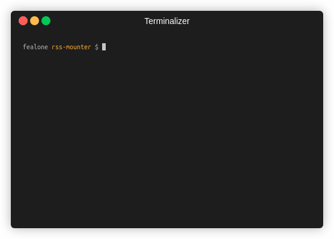

# RSS Feed mounter
Mount RSS feed with FUSE.



## What is this
With this can operate RSS feeds like a file system.

## How to use

### Installation

```bash
pip install poetry
poetry install
```

### Settings

* rss_config.yaml

```yaml
{Name}: {URL}
```

#### Example

```yaml
bigquery: https://cloudblog.withgoogle.com/products/bigquery/rss/
```

### Run

```bash
poetry run python main.py {Base directory} {Mountpoint} false
```
